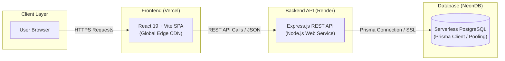

# Cognify Clothing

A modern, high-performance men's e-commerce platform featuring interactive 3D product previews, real-time garment customization, and a robust full-stack shopping architecture.

[](https://vercel.com/)
[](https://render.com/)
[](https://neon.tech/)
[](https://react.dev/)
[](https://nodejs.org/)
[](https://www.prisma.io/)

---

## Overview

**Cognify Clothing** combines modern streetwear aesthetics with cutting-edge web technologies. Built with React 19, Three.js / React Three Fiber, Node.js, Express, Prisma ORM, and PostgreSQL, the application delivers a seamless shopping experience from interactive 3D garment exploration to order placement.

---

## Architecture

The application is deployed across modern cloud platforms optimized for speed, reliability, and scalability:



---

## Key Features

- **Interactive 3D Product Visualizer**
  - Real-time 3D model rendering using Three.js and `@react-three/fiber` / `@react-three/drei`.
  - Orbit camera controls, dynamic studio lighting, and smooth WebGL canvas fallbacks.
  - Interactive garment customizer allowing color changes, graphics, custom print text, and typography selection.

- **E-Commerce Catalog & Discovery**
  - Dynamic categorization: Hoodies, Shirts, T-Shirts, and Jeans.
  - Multi-attribute filtering (category, size, color, price range) and sorting (price, popularity, rating, new arrivals).
  - Instant client-side search and responsive mobile drawer navigation.

- **Cart & Wishlist Management**
  - Persistent shopping cart supporting customized and standard product variants.
  - Item quantity controls, save-for-later functionality, and quick add/remove operations.
  - Wishlist toggle across all product cards and detail pages.

- **Checkout & Order Flow**
  - Streamlined multi-step checkout workflow with contact and shipping address validation.
  - Support for Cash on Delivery (COD) payment processing.
  - Customer order tracking with detailed line-item summaries and order status indicators.

- **User Accounts & Session Management**
  - Secure registration and login powered by bcrypt password hashing and JSON Web Tokens (JWT).
  - Dual session support with HttpOnly cookies and authorization headers.
  - Customer profile overview and historical order tracking.

---

## Tech Stack

### Frontend
- **Framework:** React 19 with Vite 8
- **Styling:** Tailwind CSS, PostCSS, Autoprefixer
- **3D Graphics & Animation:** Three.js, `@react-three/fiber`, `@react-three/drei`, GSAP, Framer Motion
- **Routing & State:** React Router v7, React Context API (`AuthContext`, `CartContext`, `WishlistContext`)
- **Icons:** Lucide React
- **Code Quality:** Oxlint

### Backend
- **Runtime & Server:** Node.js, Express.js (ES Modules)
- **Database & ORM:** PostgreSQL, Prisma ORM Client v6.10
- **Authentication:** JSON Web Tokens (`jsonwebtoken`), `bcrypt`
- **Security & Utilities:** Helmet, CORS, Cookie-Parser, Express-Rate-Limit, Dotenv

### Cloud Infrastructure & Deployment
- **Frontend Hosting:** [Vercel](https://vercel.com/) (Edge Network & Global CDN)
- **Backend API Hosting:** [Render](https://render.com/) (Web Service Node.js Runtime)
- **Database:** [Neon](https://neon.tech/) (Serverless PostgreSQL with connection pooling)

---

## Repository Structure

```text
cognify-clothing/
├── backend/
│   ├── prisma/
│   │   ├── schema.prisma       # Database schema and relations
│   │   └── seed.js             # Initial database seed script
│   ├── src/
│   │   ├── lib/
│   │   │   └── prisma.js       # Prisma client instance
│   │   ├── middleware/
│   │   │   └── auth.js         # Authentication and role verification
│   │   ├── routes/
│   │   │   ├── auth.js         # Register, login, logout, me routes
│   │   │   ├── cart.js         # User cart management endpoints
│   │   │   ├── categories.js   # Product category endpoints
│   │   │   ├── orders.js       # Transactional order placement & tracking
│   │   │   ├── products.js     # Catalog browsing and product detail routes
│   │   │   └── wishlist.js     # User wishlist endpoints
│   │   └── index.js            # Express application entry point
│   ├── .env.example            # Backend environment template
│   ├── .gitignore              # Backend ignored files
│   ├── products.json           # Catalog dataset
│   ├── run_all.bat             # One-click launch script for Windows
│   └── package.json
│
├── frontend/
│   ├── public/
│   │   ├── models/             # 3D GLTF/GLB models
│   │   └── branding/           # Graphics, favicons, brand assets
│   ├── src/
│   │   ├── 3d/                 # Three.js canvases, lighting, scenes, controls
│   │   ├── components/
│   │   │   ├── layout/         # Navbar, Footer, ScrollToTop
│   │   │   ├── sections/       # Hero, Categories, Trending, Brand sections
│   │   │   └── ui/             # Modals, buttons, rating, empty states, product cards
│   │   ├── context/            # AuthContext, CartContext, WishlistContext
│   │   ├── lib/
│   │   │   └── api.js          # Dynamic API client (reads VITE_API_URL)
│   │   ├── pages/              # Shop, Product, Cart, Checkout, Orders, Account, etc.
│   │   ├── App.jsx             # Route definitions and layout providers
│   │   └── main.jsx            # React root mount
│   ├── .env.example            # Frontend environment template
│   ├── .gitignore              # Frontend ignored files
│   ├── .oxlintrc.json          # Oxlint configuration
│   ├── vercel.json             # Vercel SPA routing configuration
│   └── package.json
│
└── README.md
```

---

## Local Development Setup

### Prerequisites
- [Node.js](https://nodejs.org/) (v18 or higher recommended)
- [npm](https://www.npmjs.com/) (v9 or higher)
- [PostgreSQL](https://www.postgresql.org/) (v14 or higher) or a free [NeonDB](https://neon.tech/) instance

---

### 1. Database Setup

Create a PostgreSQL database for the project locally, or create a project on [NeonDB](https://neon.tech/):

```sql
CREATE DATABASE cognify_clothing;
```

---

### 2. Backend Setup

1. Navigate to the `backend` folder:
   ```bash
   cd backend
   ```

2. Install dependencies:
   ```bash
   npm install
   ```

3. Create your `.env` configuration:
   ```bash
   cp .env.example .env
   ```

4. Configure the environment variables in `.env`:
   ```env
   DATABASE_URL="postgresql://<username>:<password>@localhost:5432/cognify_clothing"
   JWT_SECRET="generate-a-secure-random-secret-key-at-least-32-chars"
   JWT_EXPIRES_IN="7d"
   PORT=5000
   CLIENT_URL="http://localhost:5173"
   ```

5. Push the database schema and seed the catalog:
   ```bash
   npx prisma db push
   npm run db:seed
   ```

6. Start the development API server:
   ```bash
   npm run dev
   ```
   The backend API will start at `http://localhost:5000`.

---

### 3. Frontend Setup

1. Open a new terminal and navigate to the `frontend` folder:
   ```bash
   cd frontend
   ```

2. Install dependencies:
   ```bash
   npm install
   ```

3. (Optional) Create a `.env` file if pointing to a non-default API endpoint:
   ```bash
   cp .env.example .env
   ```

4. Start the Vite development server:
   ```bash
   npm run dev
   ```
   The web application will open at `http://localhost:5173`.

---

### 4. Running with the Batch Script (Windows)

If you are on Windows, you can launch both backend and frontend servers simultaneously using the provided batch script located in `backend`:

```bat
backend\run_all.bat
```

---

## Production Deployment Guide

Deploying Cognify Clothing to production uses **NeonDB** for serverless PostgreSQL, **Render** for the Express backend, and **Vercel** for the React frontend.

### Step 1: Database Setup on NeonDB
1. Sign up for a free account at [Neon.tech](https://neon.tech/).
2. Create a new project named `cognify_clothing`.
3. Copy your database connection string with SSL enabled:
   ```text
   postgresql://<user>:<password>@<neon-host>/cognify_clothing?sslmode=require
   ```
4. Push your schema and seed catalog data from your local terminal to NeonDB:
   ```bash
   cd backend
   npx prisma db push
   npm run db:seed
   ```

---

### Step 2: Deploy Backend API on Render
1. Sign in to [Render.com](https://render.com/) and click **New +** &rarr; **Web Service**.
2. Connect your GitHub repository.
3. Configure the service:
   - **Name:** `cognify-clothing-api`
   - **Root Directory:** `backend`
   - **Environment:** `Node`
   - **Build Command:** `npm install && npx prisma generate`
   - **Start Command:** `npm start`
4. Under **Environment Variables**, add:
   | Variable | Value |
   |---|---|
   | `DATABASE_URL` | Your NeonDB connection string from Step 1 |
   | `JWT_SECRET` | Strong random 256-bit secret string |
   | `JWT_EXPIRES_IN` | `7d` |
   | `NODE_ENV` | `production` |
   | `CLIENT_URL` | Your Vercel frontend URL (e.g. `https://cognify-clothing.vercel.app`) |
5. Click **Create Web Service**. Once deployed, copy your Render URL:
   `https://cognify-clothing-api.onrender.com`

---

### Step 3: Deploy Frontend on Vercel
1. Sign in to [Vercel.com](https://vercel.com/) and click **Add New...** &rarr; **Project**.
2. Select your GitHub repository.
3. Configure the build settings:
   - **Root Directory:** Click **Edit** and choose `frontend`.
   - **Framework Preset:** `Vite` (automatically detected).
   - **Build Command:** `npm run build`
   - **Output Directory:** `dist`
4. Under **Environment Variables**, add:
   | Variable | Value |
   |---|---|
   | `VITE_API_URL` | `https://cognify-clothing-api.onrender.com/api` (your Render URL from Step 2) |
5. Click **Deploy**. Vercel will build and serve your frontend globally. Client-side routing is handled seamlessly via `frontend/vercel.json`.

---

## API Overview

| Method | Endpoint | Description | Auth Required |
|---|---|---|---|
| `POST` | `/api/auth/register` | Register a new customer account | No |
| `POST` | `/api/auth/login` | Authenticate customer and obtain session token | No |
| `POST` | `/api/auth/logout` | Invalidate active session | Yes |
| `GET` | `/api/auth/me` | Fetch authenticated user profile | Yes |
| `GET` | `/api/products` | Retrieve products with filtering, search, and pagination | No |
| `GET` | `/api/products/:id` | Retrieve product details by ID or slug | No |
| `GET` | `/api/categories` | List all available product categories | No |
| `GET` | `/api/cart` | View current user's cart | Yes |
| `POST` | `/api/cart` | Add an item or customization to the cart | Yes |
| `PUT` | `/api/cart/:itemId` | Update cart item quantity | Yes |
| `DELETE` | `/api/cart/:itemId` | Remove an item from the cart | Yes |
| `GET` | `/api/wishlist` | View wishlisted products | Yes |
| `POST` | `/api/wishlist` | Add or toggle item in wishlist | Yes |
| `DELETE`| `/api/wishlist/:id` | Remove item from wishlist | Yes |
| `POST` | `/api/orders` | Place order with address and cart items | Yes |
| `GET` | `/api/orders` | View current user's order history | Yes |
| `GET` | `/api/orders/:id` | View specific order details | Yes |

---

## Contact & Links

- **Website:** [Cognify Solution](https://cognifysolution.com/)
- **Email:** [cognifysolution@gmail.com](mailto:cognifysolution@gmail.com)

---

## License

This project is proprietary and developed for Cognify Clothing. All rights reserved.
